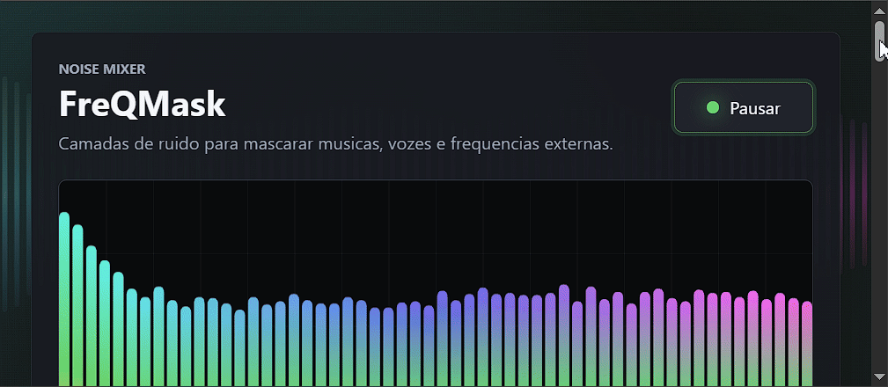

# 🎧 FreQMask

O **FreQMask** é um software que permite reproduzir e **misturar vários sons simultaneamente**, oferecendo controle individual de volume e outras configurações de áudio.
O objetivo é permitir que o usuário crie seu próprio ambiente sonoro, podendo utilizar ruídos, sons ambientes, músicas e arquivos personalizados.
## Demo / Preview
  

## 🔊 Recursos

* 🎚️ Mixer com controle individual de volume
* ⚪ Ruído Branco
* 🌸 Ruído Rosa
* 🟤 Ruído Marrom
* 🔵 Ruído Azul
* ⚫ Ruído Preto
* 🌧️ Diversos sons ambientes
* 🎵 Adição de sons próprios
* ⏱️ Temporizador
* 🔁 Reprodução em loop
* 🎛️ Controle de frequências
* 🎧 Suporte a fones com ANC

## 🛠️ Tecnologias
• Java Script
• CSS
• HTML

## 🚧 Status
**Versão:** `v1.0.0`

## ⚠️ Aviso
O FreQMask é uma ferramenta de **mascaramento sonoro** e não substitui isolamento acústico, ANC ou proteção auditiva. Evite volumes elevados por períodos prolongados.
